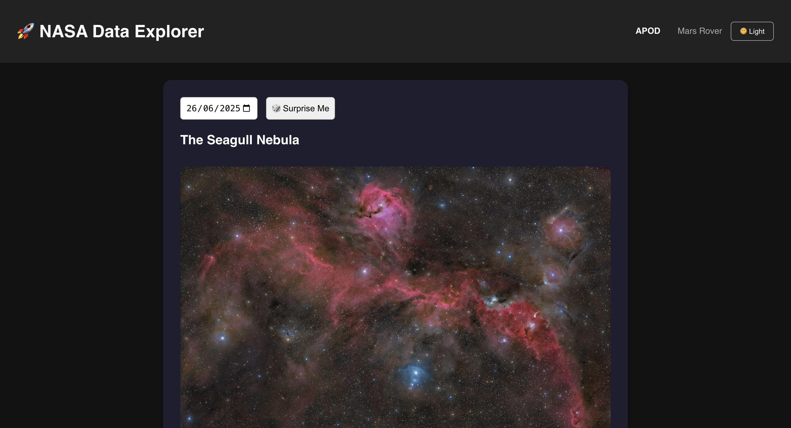

### 🚀 NASA Data Explorer
An interactive web application built with React and Node.js to explore publicly available data from NASA Open APIs. From Astronomy Pictures of the Day to Mars Rover images, this app brings space to your screen with beautiful visuals and intuitive UI.

### 🖼 Live Application
Frontend (Vercel) : nasa-data-explorer-f6v9x44dt-gunjans-projects-a12f7e80.vercel.app
Backend (Render): https://nasa-data-explorer-ifsi.onrender.com

### 📁 Repository Structure
nasa-data-explorer/
├── backend/                # Node.js + Express API server
│   └── index.js
├── frontend/               # React application
│   ├── public/
│   ├── src/
│   │   ├── components/
│   │   │   ├── APOD.js
│   │   │   ├── MarsRover.js
│   │   │   └── ...
│   │   └── App.js
│   └── package.json
└── README.md

### 🛠 Technologies Used

Frontend: React, Axios, CSS Modules / Tailwind / Custom styling

Backend: Node.js, Express, Axios

External API: NASA Open APIs (api.nasa.gov)

Deployment:

Frontend: Vercel

Backend: Render or Railway

### 🔧 Setup Instructions 
Clone the repository:

git clone https://github.com/gunjankokru/nasa-data-explorer.git
cd nasa-data-explorer

▶️ Start the Backend

cd backend
npm install
node index.js

Make sure your backend is running at http://localhost:8080

💻 Start the Frontend

cd ../frontend
npm install
npm start

The frontend runs on http://localhost:3000 and will fetch data via the backend.

### 🌐 Deployment Notes
-> Frontend on Vercel
-> Set the root directory to frontend
-> No additional build config required (auto-detected as React)
-> Deploy URL: https://your-vercel-site.vercel.app
-> Backend on Render or Railway
-> Deploy backend/ as a Node app
->Set environment variable: NASA_API_KEY
->Use index.js as entry point

### 🌌 Astronomy Picture of the Day

### 🚗 Mars Rover Image Explorer

