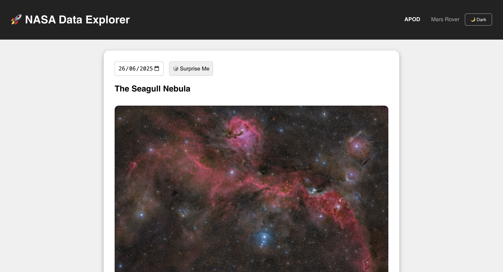
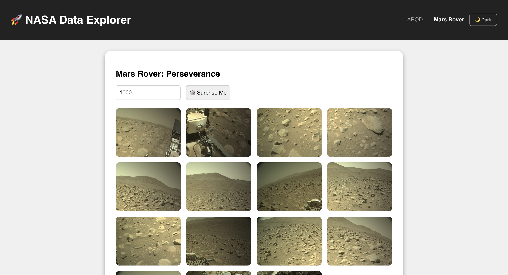
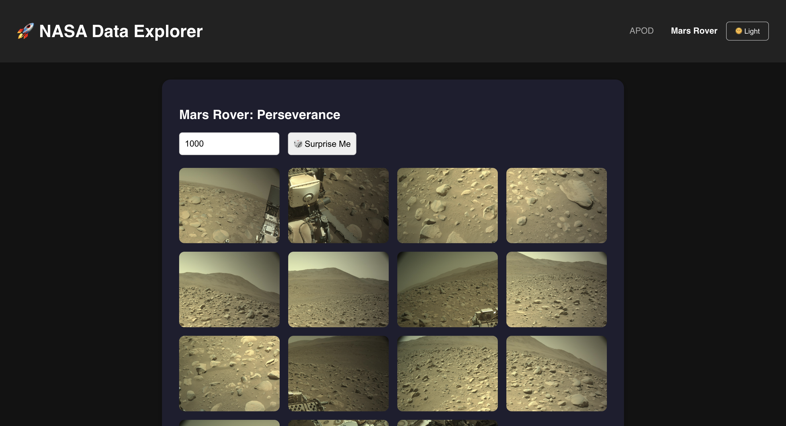

Here's the properly formatted README.md in raw markdown format, optimized for GitHub:

```markdown
# 🚀 NASA Data Explorer

An interactive web application built with **React** and **Node.js** to explore publicly available data from NASA Open APIs.  
From **Astronomy Pictures of the Day** to **Mars Rover images**, this app brings space to your screen with beautiful visuals and an intuitive UI.

---

## 🖼 Live Application

- **Frontend (Vercel):** [nasa-data-explorer.vercel.app](https://nasa-data-explorer-f6v9x44dt-gunjans-projects-a12f7e80.vercel.app)  
- **Backend (Render):** [nasa-data-explorer.onrender.com](https://nasa-data-explorer-ifsi.onrender.com)

---

## 📁 Repository Structure

```
nasa-data-explorer/
├── backend/               # Node.js + Express API server
│   ├── index.js
│   └── package.json
├── frontend/              # React application
│   ├── public/
│   │   └── screenshots/
│   ├── src/
│   │   ├── components/
│   │   │   ├── APOD.js
│   │   │   ├── MarsRover.js
│   │   ├── App.js
│   │   └── index.js
│   └── package.json
├── .gitignore
└── README.md
```

---

## 🛠 Technologies Used

### 🖥️ Frontend
- React
- Axios
- Tailwind CSS / CSS Modules

### 🛠️ Backend
- Node.js
- Express
- Axios

### 🌐 External APIs
- [NASA Open APIs](https://api.nasa.gov)

### 🚀 Deployment Platforms
- **Frontend:** Vercel  
- **Backend:** Render / Railway

---

## 🧑‍💻 Getting Started

### 1️⃣ Clone the Repository
```bash
git clone https://github.com/gunjankokru/nasa-data-explorer.git
cd nasa-data-explorer
```

### 2️⃣ Start the Backend
```bash
cd backend
npm install
node index.js
```
Backend runs at: http://localhost:8080

### 3️⃣ Start the Frontend
```bash
cd ../frontend
npm install
npm start
```
Frontend runs at: http://localhost:3000

---

## 🌐 Deployment Notes

### 📦 Frontend on Vercel
- Set project root to `frontend`
- React auto-detected by Vercel
- No build config needed

### ⚙️ Backend on Render/Railway
1. Deploy the `backend/` folder as Node.js app  
2. Set environment variable:
```env
NASA_API_KEY=your_actual_nasa_api_key_here
```
3. Entry point: `index.js`

---

## 🌌 Screenshots

### Astronomy Picture of the Day (APOD)
| Light Mode | Dark Mode |
|------------|-----------|
|  |  |

### 🚗 Mars Rover Image Explorer
| Light Mode | Dark Mode |
|------------|-----------|
|  |  |
```